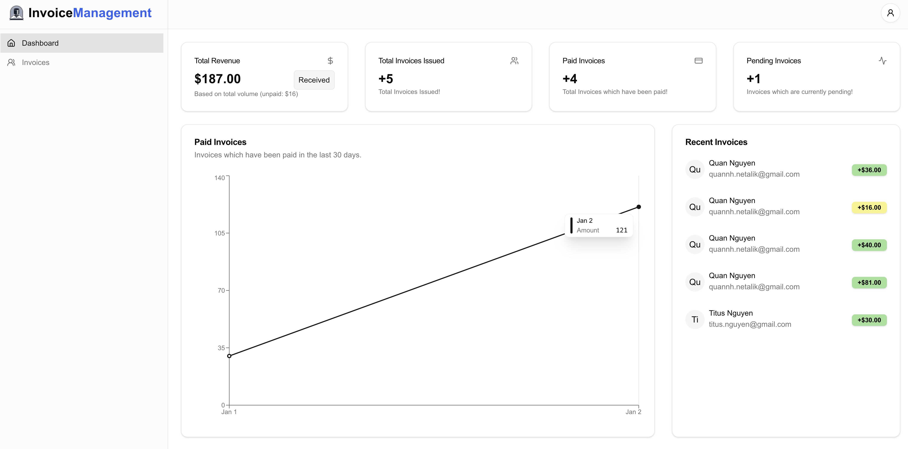

# Invoice Management

The project provides interface for managing invoices, allowing user to visualize invoices data via [shadcn/chart](https://ui.shadcn.com/docs/components/chart)



## Tech stacks

- [Next.js (v15)](https://nextjs.org/docs)
- [AuthJs](https://authjs.dev/)
- [Tailwind](https://tailwindcss.com/)
- [Shadcn](https://ui.shadcn.com)
- [Prisma](https://www.prisma.io/)
- [Neon](https://console.neon.tech/app/projects) for `database`
- [Conform](https://conform.guide/) & [Zod](https://zod.dev/) for `form validation & management`
- [Mailtrap](https://mailtrap.io/)

## Getting Started

First, run the development server:

```bash
npm run dev
# or
yarn dev
# or
pnpm dev
# or
bun dev
```

Open [http://localhost:3000](http://localhost:3000) with your browser to see the result.
